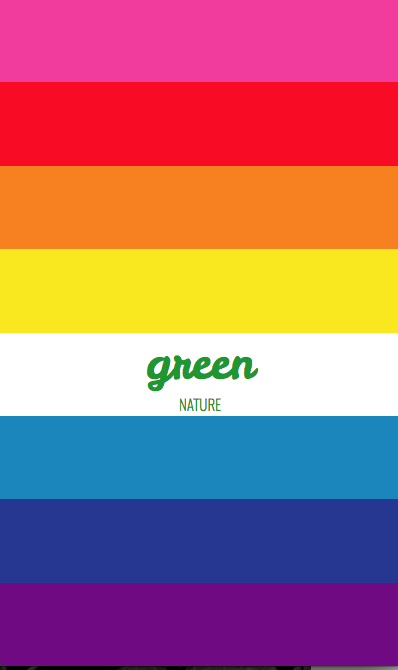

# CSS Grid First Attempt

## Technologies used
* html
* css(css grid in particular)
** In particular I wanted to test the responsivity of css grid
## Approach taken
* I wanted to play around with the basic grid system introduced recently in css. In the future, I would like to implement more use of css grid, and also simplify my style sheet because currently it is redundant. I picked the rainbow flag motif to celebrate pride month, and also added some simple css hover animations. I may iterate on this in the future. 

##Resources

## Images

{:height="50%" width="50%"}